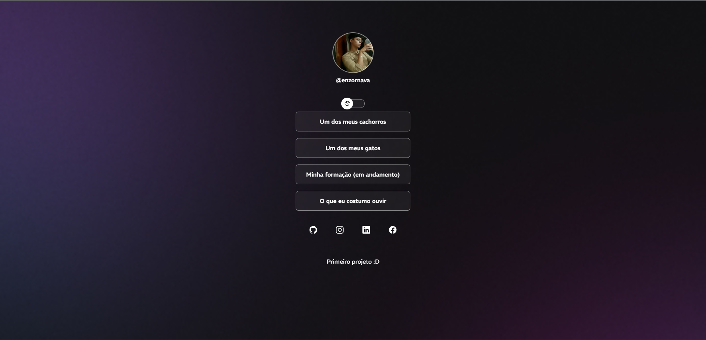
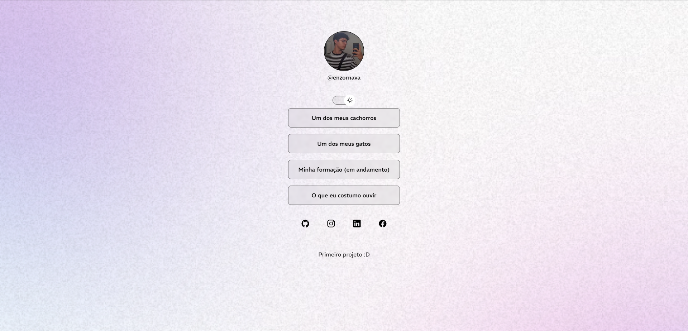

<h1 align="center"> MySocialLiking </h1>

Programa realizado de acordo com o curso Discover "DevLinks", by RocketSeat  

  <a href="#-tecnologias">Tecnologias</a>&nbsp;&nbsp;&nbsp;|&nbsp;&nbsp;&nbsp;
  <a href="#-projeto">Projeto</a>&nbsp;&nbsp;&nbsp;|&nbsp;&nbsp;&nbsp;
  <a href="#-layout">Layout</a>&nbsp;&nbsp;&nbsp;|&nbsp;&nbsp;&nbsp;
  <a href="#memo-licença">Licença</a>

  
  
  
  
  
  

 

## 🚀 Tecnologias Utilizadas

Esse projeto foi desenvolvido com as seguintes tecnologias:

- HTML e CSS
- JavaScript
- Git e Github
- Figma

## 💻  O Projeto

O projeto é um agregador de links para usar como cartão de visitas online.

- [Acesse o projeto finalizado, online](https://navenz.github.io/mysociallinking/)

#

## Licença

Esse projeto está sob a licença MIT.
